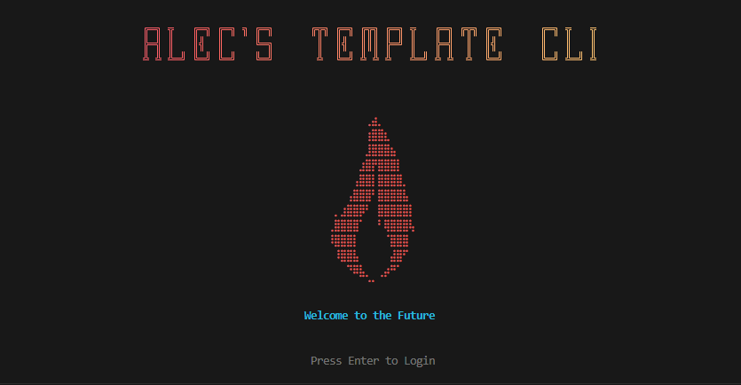

# Alec's Template CLI

A beautiful, interactive CLI template built with Ink and React, featuring an animated flame splash screen and comprehensive entity management.



## Features

- **Animated Splash Screen** - Eye-catching ASCII flame animation with gradient title
- **Local Auth Server** - Real HTTP server for browser-based authentication
- **Entity Management** - Full CRUD operations for Teams and Repositories
- **Advanced Forms** - Multi-select inputs, dropdowns, and smart filtering
- **Request Tracking** - In-memory storage of all operations
- **Type-Safe** - Built with TypeScript for robust development

## Installation

```bash
npm install
```

## Usage

Build the project:
```bash
npm run build
```

Start the CLI:
```bash
npm start
```

## Tech Stack

- **[Ink](https://github.com/vadimdemedes/ink)** - React for CLIs
- **TypeScript** - Type-safe development
- **ink-gradient** - Beautiful gradient text
- **ink-big-text** - Large ASCII text rendering
- **Node.js HTTP Server** - Local authentication

## Project Structure

```
src/
├── cli.tsx              # Entry point
├── app.tsx              # Main application logic
├── auth-server.ts       # Local HTTP auth server
└── components/
    ├── Splash.tsx       # Animated splash screen
    ├── LoginServer.tsx  # Login flow component
    ├── Dashboard.tsx    # Main menu
    ├── EntitySelector.tsx # Searchable entity list
    ├── EntityForm.tsx   # Advanced form inputs
    └── RequestList.tsx  # Request history
```

## License

MIT
